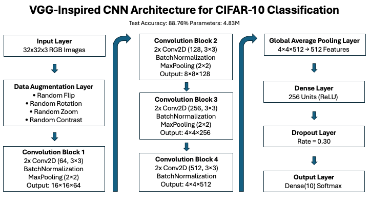
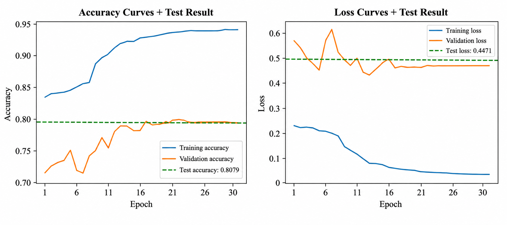
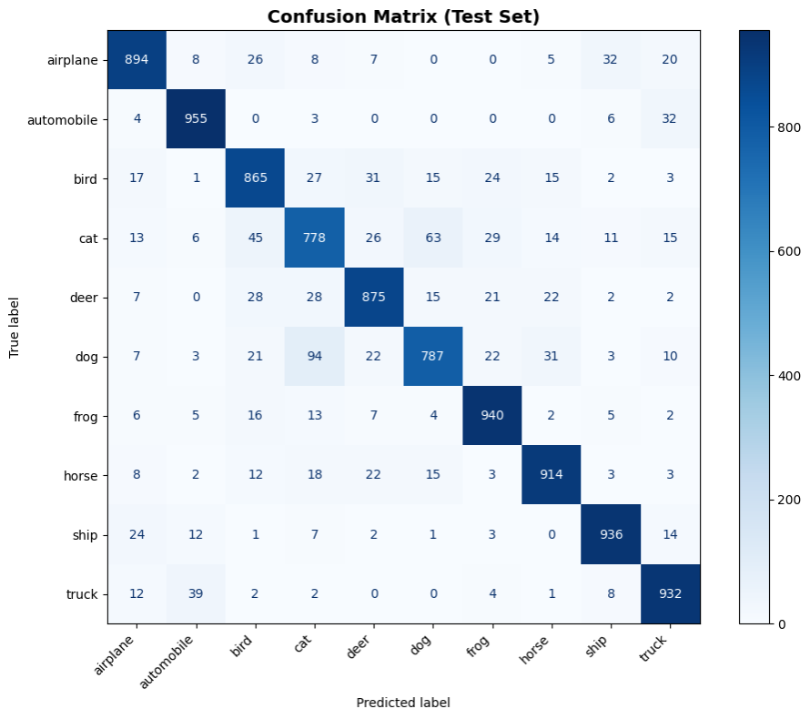

# CIFAR-10 Image Classification with Bayesian Hyperparameter Optimization

## Project Overview

This project implements a VGG-inspired Convolutional Neural Network (CNN) for CIFAR-10 image classification. The model achieves 88.76% test accuracy using Bayesian optimization for hyperparameter tuning and incorporates data augmentation techniques to improve generalization.

## Project Objectives

- Develop a custom CNN capable of achieving at least 85% validation accuracy on CIFAR-10
- Optimize architecture and training hyperparameters using Bayesian Optimization
- Evaluate robustness using CIFAR-10-C corrupted datasets
- Analyze per-class performance using confusion matrices and classification metrics

## Recognition

Awarded the WGU Excellence Award for outstanding performance and exceptional quality of work submitted in the Master of Science in Computer Science program. The project evaluated, analyzed, and optimized a self-designed convolutional neural network trained on the CIFAR-10 dataset.

## Results

- Test Accuracy: 88.76%
- Validation Accuracy: 89.23%
- Dataset: CIFAR-10 (60,000 images)
- Hyperparameter Tuning: Bayesian Optimization (30 trials)
- Robustness Testing: CIFAR-10-C

## Key Features

✓ Data augmentation for improved generalization  
✓ Bayesian optimization for efficient hyperparameter tuning  
✓ Batch normalization for training stability  
✓ GlobalAveragePooling for parameter efficiency  
✓ Early stopping to prevent overfitting  
✓ Comprehensive evaluation with confusion matrix and per-class metrics  
✓ Model checkpointing to save best weights  
✓ CIFAR-10-C robustness testing

## Dataset

**CIFAR-10** consists of 60,000 32×32 color images in 10 classes:
- airplane, automobile, bird, cat, deer, dog, frog, horse, ship, truck

**Data Split:**
- Training: 40,000 images
- Validation: 10,000 images
- Test: 10,000 images

**Preprocessing:**
- Pixel values normalized to [0, 1]
- Labels one-hot encoded
- Preprocessed data stored in `cifar10_clean.npz`

NOTE: This project uses the CIFAR-10 dataset, which is automatically downloaded through TensorFlow/Keras during execution. The processed dataset file (`cifar10_clean.npz`) is not included in this repository because it exceeds GitHub file size limits and can be regenerated using (`Data_Preprocessing.ipynb`).

## Reproducing the Dataset

The processed dataset file is not included due to GitHub file size limitations.

To recreate the dataset:

1. Run `data_preparation.ipynb`
2. This generates `cifar10_clean.npz`
3. Run `cnn_image_classification.ipynb`

## Model Architecture



This model is a VGG-inspired convolutional neural network designed for CIFAR-10 image classification. The architecture consists of four convolutional blocks with increasing filter counts, data augmentation layers, batch normalization, max pooling, global average pooling, dropout regularization, and dense classification layers. Hyperparameters were selected using Bayesian optimization.

## Training Curves



The model converged after approximately 20 epochs and achieved strong validation and test performance. Although training accuracy was substantially higher than validation accuracy, the similarity between validation and test results indicates effective generalization to unseen data.

## Confusion Matrix



The model achieved strong performance across all classes, with the most common misclassifications occurring between cats and dogs, a known challenge in the CIFAR-10 dataset.

## Dependencies

Install required packages:

```bash
pip install --upgrade pip
pip install tensorflow tensorboard scikit-learn matplotlib numpy opencv-python keras-tuner
```

**Requirements**
- Python 3.11
- TensorFlow
- Keras
- Keras Tuner
- NumPy
- Matplotlib
- Scikit-learn
- OpenCV

## Repository structure

```
.
├── README.md                           # This file
├── Image_Classification_Model.ipynb    # Jupyter notebook for model
├── Data_Preprocessing.ipynb            # Jupyter notebook for CIFAR-10 preprocessing
├── best_model_v4_final.keras           # Final trained model
├── Model_Report.pdf                    # Detailed project report
├── Images
    ├── Architecture.png                # CNN architecture diagram
    ├── Confusion_Matrix.png            # Test set confusion matrix
    ├── Training_Curves.png             # Accuracy and loss curves
```

## Usage

### Option 1: Load Pre-trained Model

The submitted notebook includes the full model-building and tuning code for reproducibility. Because Bayesian optimization and training required over 16 hours, the final trained model is also provided as best_model_v4_final.keras. To verify results without retraining, load the saved model and evaluate it using the test data contained in cifar10_clean.npz. The code below is also included at the end of the notebook.

```python
import numpy as np
from keras.models import load_model

# Load processed dataset
data = np.load('cifar10_clean.npz')

X_test = data['X_test']
y_test = data['y_test']

# Load trained model
model = load_model('best_model_v4_final.keras')

# Evaluate
results = model.evaluate(X_test, y_test)
print(results)
```

### Option 2: Run full Notebook

```bash
jupyter notebook Image_Classification_Model.ipynb
```
**Note:** Full training with Bayesian optimization took over 16 hours on Apple M4 Max system (16-core CPU, 40-core GPU, 48GB unified memory).

## Hyperparameter Tuning

Bayesian Optimization was used to tune filter count, dense units, dropout rate, and learning rate over 30 trials.

## Future Improvements

- Experiment with residual connections (ResNet-style blocks)
- Explore transfer learning approaches
- Evaluate larger image datasets
- Investigate advanced augmentation techniques

## Notes

The notebook assigns the best model obtained during development to the best_model variable for obtaining the confusion matrix, model summary, and other reports. This is done at the beginning of each relevant cell as follows:
```python
from keras.models import load_model

best_model = load_model("best_model_v4_final.keras")